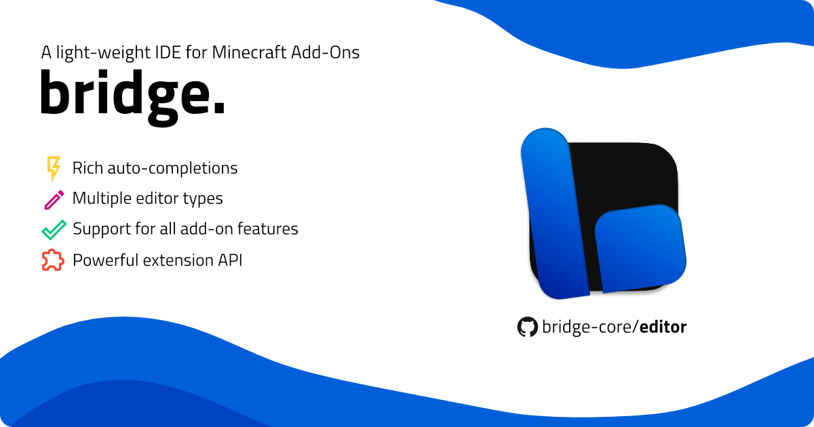

# bridge. v2

  

## Installation & Usage

Our [getting started guide](https://bridge-core.app/guide/) is the perfect way to get familiar with the editor. It will guide you through the installation process and show you how to create your first bridge. project. You can find it [here](https://bridge-core.app/guide/).

## Contributing

The bridge. team is grateful for any contributions you make to the various projects we work on.
Please don't hesitate reaching out to us on any of the platforms listed [here](https://bridge-core.app/guide/community.html) to discuss your ideas and/or suggestions for improving bridge. or if you simply need help making your first contribution.

Contributing to bridge. can be as "easy" as helping us improve our [documentation](https://github.com/bridge-core/docs/) by editing Markdown files, editing our [editor data](https://github.com/bridge-core/editor-packages/) which mostly consists of JSON or [creating a new extension](/extensions/). You do not need to work on the [core editor](https://github.com/bridge-core/editor/) and its related libraries to make valuable contributions to our projects.

Please also read our [Contributing Guidelines](./CONTRIBUTING.md) before you start working on a pull request.
