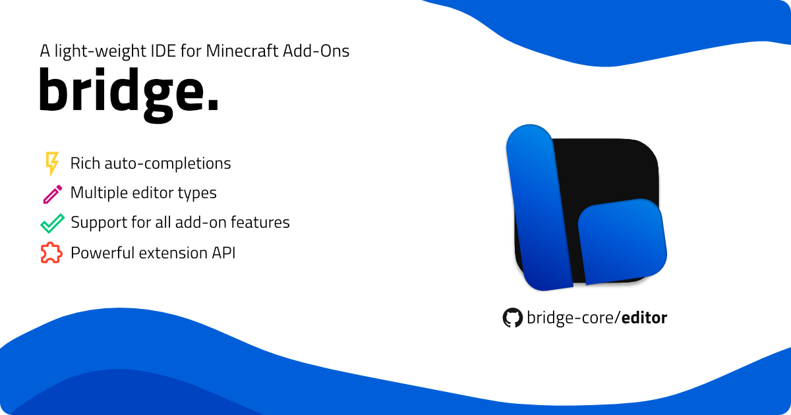

# bridge. v2

  

このREADMEは日本語バージョンです。元ファイルは [こちら](./README.md)。 ローカライズチームは常に新しい情報をチェックしていますが、情報が古い場合があるのでご注意ください。

また、訳者のちょっとした注釈も加えております。

## インストールと使い方

私たちの [スタートガイド](https://bridge-core.app/guide/) は、エディターに慣れるための最適な方法です（英語）。インストール手順、そして初めての bridge. プロジェクトを作成する方法をご案内します。[こちら](https://bridge-core.app/guide/) からご覧いただけます（英語）。

## 貢献

bridge.チームは、私たちが取り組む様々なプロジェクトへのあらゆる貢献に感謝しています。
bridge.の改善に関するアイデアや提案について話し合いたい場合、あるいは初めての貢献をする際にサポートが必要な場合は、[こちらに記載されている](https://bridge-core.app/guide/community.html)　（英語） ここに記載されているいずれかのプラットフォームから遠慮なくご連絡ください。

bridge. への貢献は、Markdown ファイルを編集して [ドキュメント](https://github.com/bridge-core/docs/)　（Github） を改善する手助けをすることや、ほとんどが JSON で構成されている [エディターデータ](https://github.com/bridge-core/editor-packages/) の編集、または [新しい拡張機能の作成](https://bridge-core.app/extensions/contributing.html) （英語）　のように「簡単な」ものである場合もあります。私たちのプロジェクトに価値のある貢献をするために、[コアエディター](https://github.com/bridge-core/editor/) (Github) やそれに関連するライブラリに携わる必要はありません。

プルリクエストを作成して作業を開始する前に、[貢献ガイドライン](./CONTRIBUTING_jp.md) (日本語化済み) を最後までしっかりとお読みください。