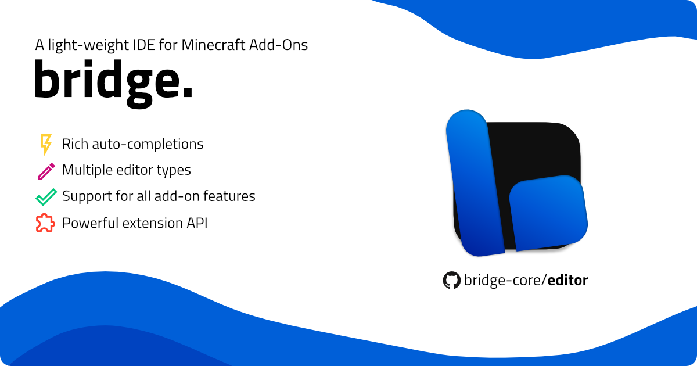

# bridge. v2

Other Languages: [English](./README.md) | **日本語**

  

> **💡 Note:**
> このドキュメントは日本語翻訳版です。最新の正確な情報は [英語版のREADME.md](./README.md) をご覧ください。

# インストールと使い方

エディタの基本的な使い方やインストール方法は、公式の [スタートガイド](https://bridge-core.app/guide/) (英語)をご覧ください。最初の「bridge.」プロジェクトを作成するまでの手順をわかりやすく解説しています。

# 貢献 (Contributing)

bridge. チームは、プロジェクトへのあらゆる貢献を大歓迎しています！

改善のアイデアや提案がある場合、または初めての貢献でサポートが必要な場合は、[コミュニティページ](https://bridge-core.app/guide/community.html) (英語) に記載されているプラットフォームから、いつでもお気軽にご連絡ください。
「bridge.」への貢献は、決して難しいことばかりではありません。

- Markdownファイルを編集して [ドキュメント](https://github.com/bridge-core/docs/) を改善する
- 主にJSONで構成されている [エディタデータ](https://github.com/bridge-core/editor-packages/) を編集する
- [新しい拡張機能を作成する](https://bridge-core.app/extensions/contributing.html) (英語)

これらも非常に貴重な貢献です。価値のある貢献をするために、必ずしも [コアエディタ](https://github.com/bridge-core/editor/) やその関連ライブラリのコードを直接編集する必要はありません。

**⚠️ 重要:** 
作業を開始してPull Requestを送信する前に、必ず [貢献ガイドライン (日本語版)](./CONTRIBUTING_jp.md) をご一読ください。
